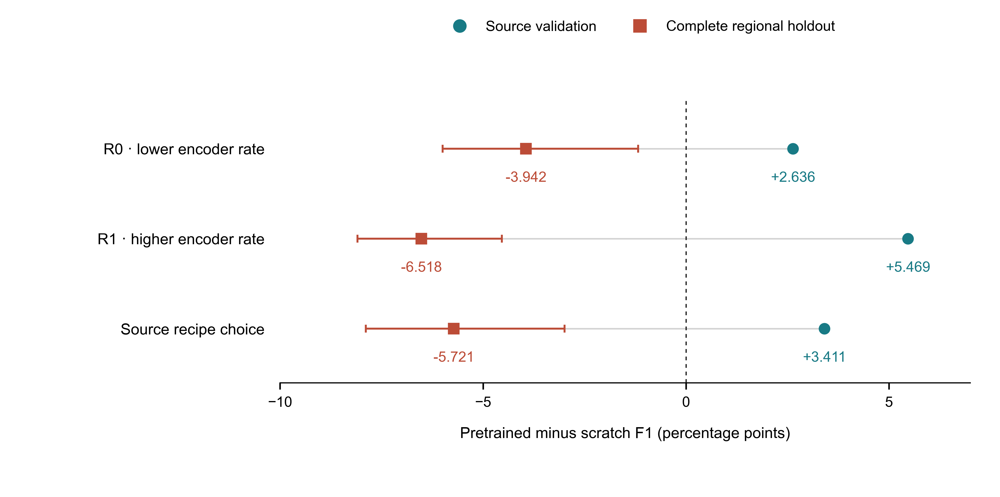
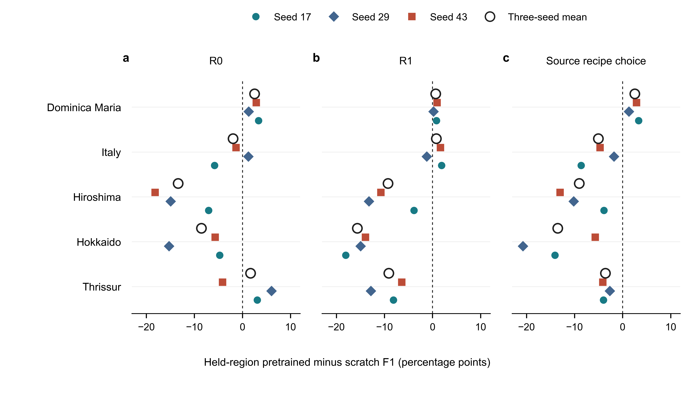
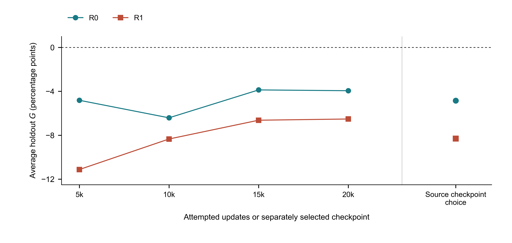

# Stored results

At 20,000 attempted updates and threshold 0.5, the recorded values are:

| Procedure | Source G (pp) | Holdout P / S F1 (%) | Holdout G (pp) |
|---|---:|---:|---:|
| R0 | +2.636 | 12.399 / 16.342 | −3.942 |
| R1 | +5.469 | 9.947 / 16.465 | −6.518 |
| Source R0/R1 choice | +3.411 | 10.809 / 16.530 | −5.721 |

The CSVs preserve the original precision, missing values, and selected recipes. Stored G is used directly; rounded P and S values are not subtracted to replace it. The selected source scores participated in choice and are not independent validation.

`Table1_primary_endpoints.csv` contains the stored 95% conditional spatial intervals. `Table2_region_results.csv` gives all 15 regional means. `S2_outer_all_region_seed_endpoints.csv` gives 165 paired rows over all recorded endpoints, including the 45 primary pairs. `S3` and `S4` contain stored regional and macro endpoint summaries. `S5` contains all 480 fold/seed/arm source rows. `S6` retains all 30 source recipe choices; its outer fields are descriptive records, not selection inputs.

`S7` and `S8` contain the existing matched-support diagnostics for every region and seed. `S9` preserves all 240 regional confusion-count/metric rows. `S10` is the R1 formal inventory; `R0_formal_run_inventory.csv` retains the R0 numerical and identity fields with private paths removed. `S11` contains the nine seed macro gains. `SOURCE_MAP.csv` uses neutral source-record labels. `summary.json` preserves the full precision primary, interval, seed, and source summary sections.

`R0_trajectory_summary.csv` and `R0_seed_summary.csv` preserve the earlier full endpoint summaries and intervals. The two `*_bootstrap_replicates.csv` files contain the saved scalar replicates, copied without resampling. The corresponding spatial interval JSON records retain the original block counts, weight hashes, validity counts, and interval values. Their recorded check status describes the original verification, not a new calculation in this candidate.

Circles show source validation G; squares show complete regional holdout G and the stored intervals. No source interval is available. The source-choice score is part of selection. Every point is a stored 20k endpoint.

The three panels show R0, R1, and source recipe choice. Filled markers display all 45 primary paired seed gains; open markers display the 15 stored regional means. Vertical offsets only separate marks. The seeds are repeats within fixed caches, not independently sampled events. No seed spread or new interval is calculated.

Lines connect the four existing fixed checkpoints. The separate right-hand marks show the original source checkpoint choices; they are not common later training steps. No new endpoint is interpolated.

The average holdout G is negative in all three procedures, while regional directions differ. Positive relative gains can accompany low absolute F1. The results do not establish reliable operational mapping. The existing spatial intervals condition on the caches, models, and seeds, and do not cover new-region uncertainty or the historical development process.

